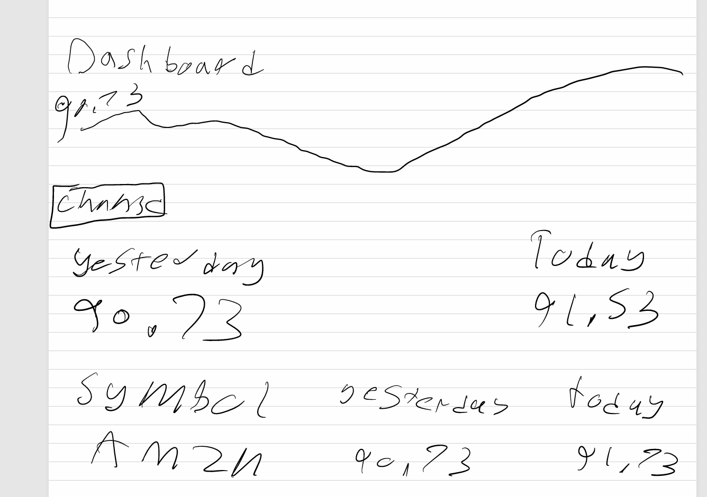

## Final Project

## Topics
I want to look into stock market performance, with a focus on Amazon and any other major tech stock. I want to see how stock prices react to news events, earning reports, and any other market trends over time. This is just an idea that I have in my head.

# Questions
Is there a visible relationship between trading volume spikes and price volatilty?
Can I build a demo interactive tool that let user pick a stock and a data range?
How has tech stock price moved over the last 5 to 10 years and making board to help see these range?

# Potenital Dataset
Source: https://www.kaggle.com/datasets/varpit94/amazon-stock-data - all the type of data to see into Amazon stock dataset
# Related Works
Source: https://finance.yahoo.com/markets/stocks/article/amazon-stock-just-entered-the-danger-zone-104050035.html - An article that talk about recent Amazon stock dip

# Sketches
