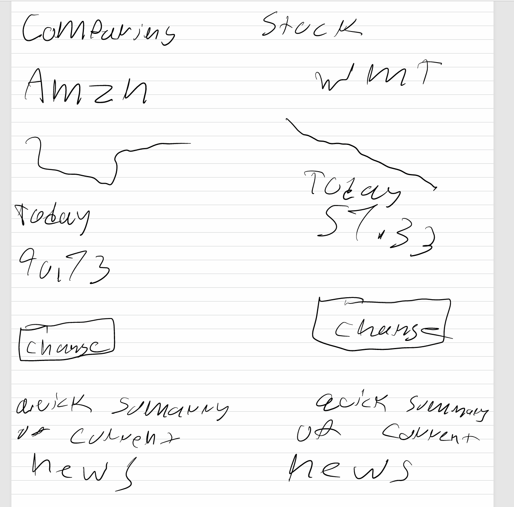
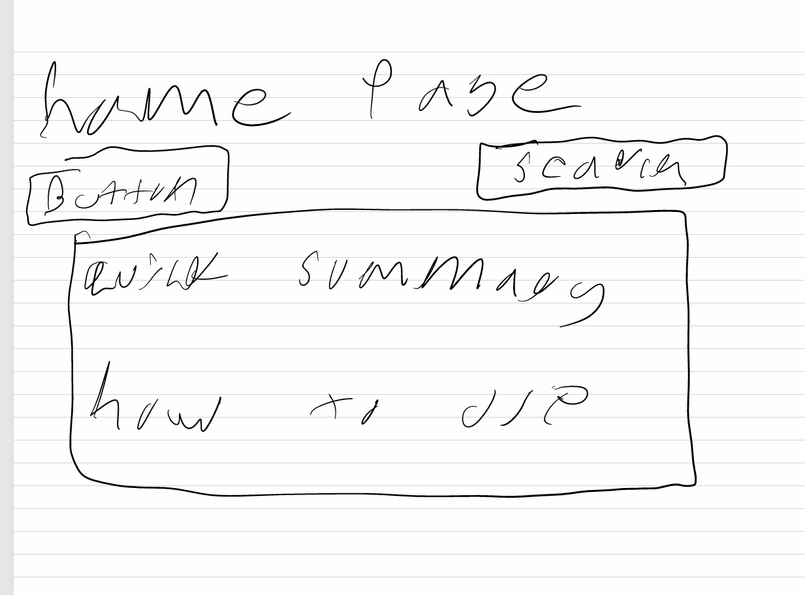

## Final Project

## Topics
I want to look into stock market performance, with a focus on Amazon and any other major tech stock. I want to see how stock prices react to news events, earning reports, and any other market trends over time. This is just an idea that I have in my head.

# Questions
Is there a visible relationship between trading volume spikes and price volatilty?
Can I build a demo interactive tool that let user pick a stock and a data range?
How has tech stock price moved over the last 5 to 10 years and making board to help see these range?

# Potenital Dataset
Source: https://www.kaggle.com/datasets/varpit94/amazon-stock-data - all the type of data to see into Amazon stock dataset
# Related Works
Source: https://finance.yahoo.com/markets/stocks/article/amazon-stock-just-entered-the-danger-zone-104050035.html - An article that talk about recent Amazon stock dip

# Sketches

When I made this sketch, I want to look at Amazon's stock performance from the past to the present that we got from the dataset. The goal is to let the users compare how the stock has changed over time and see important trends or changes. Then I want to include short summary of the business so the people can understand

When I made this sketch, I want it to compare two stock performance from the present and past that we got from the dataset. The goal is to see the difference of the performance between the two then I wanted to include button to change company for the stock with at least 30 business to compare.

When I made this sketch, I want to make a home page for the dashboard and make it interactive to switch between what to look at